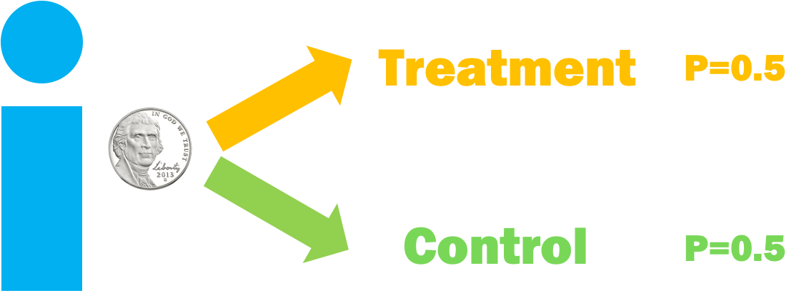
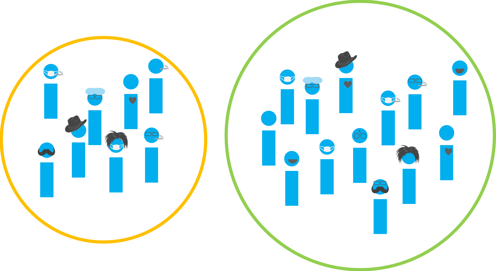
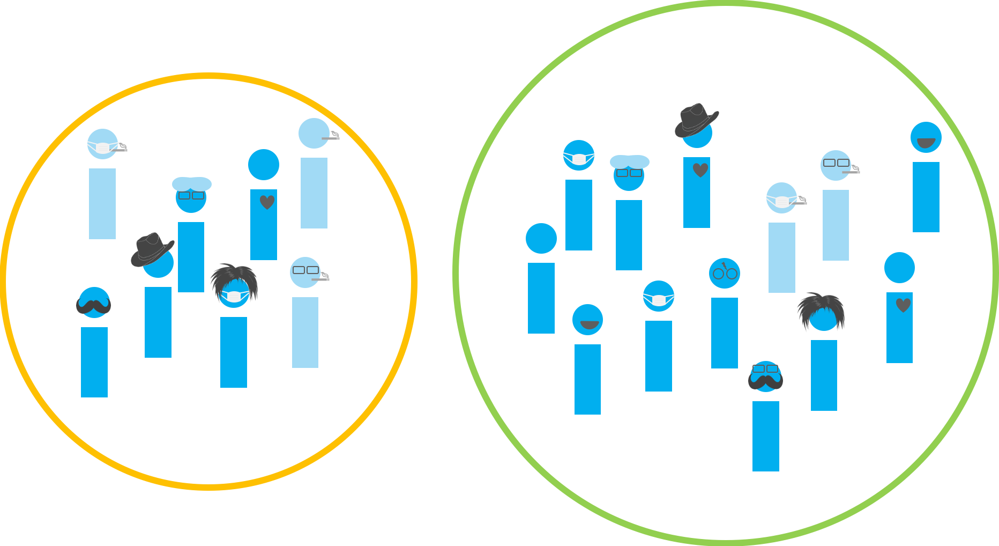
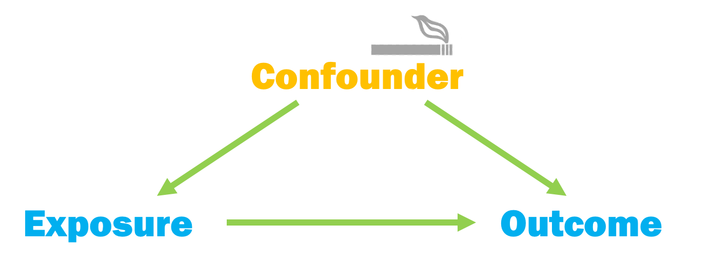
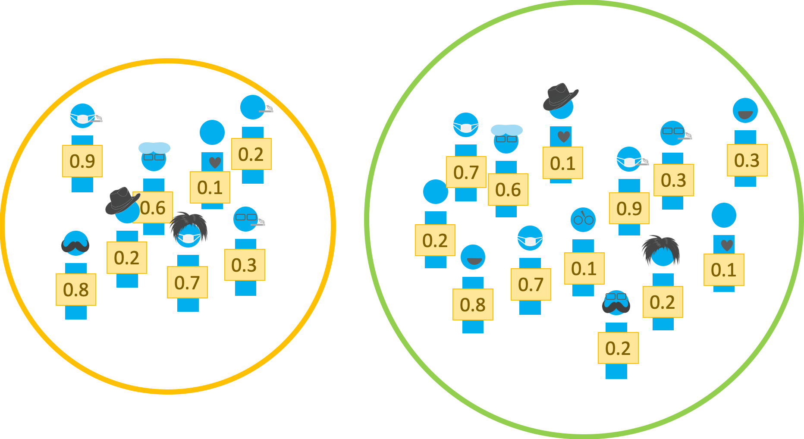

```{r, include = FALSE}
knitr::opts_chunk$set(warning = FALSE, message = FALSE, fig.align = "center", dpi = 320, fig.height = 4)
```

class: inverse

## Observational Studies

**Goal**: To answer a research question


---
class: inverse

## Observational Studies

**Goal**: To answer a research question


---
class: inverse

## ~~Observational Studies~~
### **Randomized Controlled Trial**


---
class: inverse

## ~~Observational Studies~~
### **Randomized Controlled Trial**



---
class: inverse

## Observational Studies


---
class: inverse



---
class: inverse


---
class: inverse

## Confounding


---
class: inverse

## Confounding



---

## Propensity scores

Rosenbaum and Rubin showed in observational studies, conditioning on **propensity scores** can lead to unbiased estimates of the exposure effect

1. There are no unmeasured confounders
2. Every subject has a nonzero probability of receiving either exposure

---

## Propensity scores

* Fit a **logistic regression** predicting exposure using known covariates

$$Pr(exposure = 1) = \frac{1}{1+\exp(-X\beta)}$$

* Each individuals' predicted values are the **propensity scores**

---

## Propensity scores

```{r, message = FALSE, warning = FALSE}
library(tidyverse)
library(broom)
```

---

## Propensity scores

```{r, eval = FALSE}
glm(exposure ~ confounder_1 + confounder_2 + confounder_3 + ..., 
    data = df,
    family = binomial())
```

---

## Propensity scores

```{r, eval = FALSE}
glm(exposure ~ confounder_1 + confounder_2 + confounder_3 + ..., 
    data = df,
    family = binomial()) %>%
  augment(type.predict = "response", data = df) 
```

---

## Propensity scores

```{r, eval = FALSE}
glm(exposure ~ confounder_1 + confounder_2 + confounder_3 + ..., 
    data = df,
    family = binomial()) %>%
  augment(type.predict = "response", data = df) #<<
```

---
class: inverse

## Propensity scores



---

```{r, echo = FALSE, message = FALSE, warning = FALSE, fig.height = 5.5}
library(cidata)
library(ggdag)
set.seed(1234)
# set up DAG
smk_wt_dag <- dagify(
  # specify causes of quitting smoking and weight gain:
  qsmk ~ sex + age + smokeyrs + wt71,
  wt82_71 ~ sex + age + smokeyrs + wt71,
  # specify causal question:
  exposure = "qsmk", 
  outcome = "wt82_71",
  # set up labels:
  # here, I'll use the same variable names as the data set, but I'll label them
  # with clearer names
  labels = c(
    # causal question
    "qsmk" = "quit\nsmoking (qsmk)",
    "wt82_71" = "change in\nweight",
    
    # demographics
    "age" = "age",
    "sex" = "sex",
    
    # health
    "wt71" = "baseline\nweight (wt71)",
    
    # smoking history
    "smokeyrs" = "yrs of\nsmoking (smokeyrs)"
  )
) %>% 
  tidy_dagitty()

smk_wt_dag %>% 
  ggdag(text = FALSE, use_labels = "label") 
```

---

class: inverse

## Your turn

`r countdown::countdown(minutes = 10)`

1. Using the **confounders** identified in the previous DAG, fit a propensity score model for `qsmk`
2. Stretch: Create two histograms, one of the propensity scores for those that quit smoking and one for those that do not


