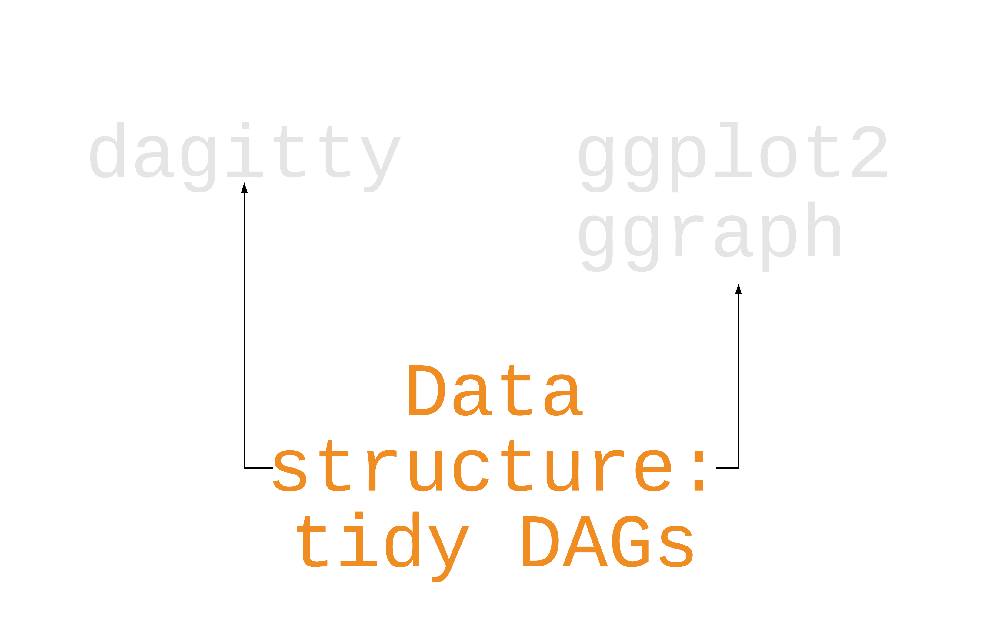

class: middle, center, inverse

```{r setup, include=FALSE}
options(htmltools.dir.version = FALSE, tibble.max_extra_cols = 6, tibble.width = 60)
knitr::opts_chunk$set(warning = FALSE, message = FALSE, fig.align = "center", dpi = 320, fig.height = 4)
library(tidyverse)
library(ggdag)

set.seed(1234)

smk_wt_dag <- dagify(
  # specify causes of quitting smoking and weight gain:
  qsmk ~ sex + race + age + education + 
    smokeintensity + smokeyrs + exercise + active + wt71,
  wt82_71 ~ qsmk + sex + race + age + education + 
    smokeintensity + smokeyrs + exercise + active + wt71,
  # specify causal question:
  exposure = "qsmk", 
  outcome = "wt82_71",
  # set up labels:
  # here, I'll use the same variable names as the data set, but I'll label them
  # with clearer names
  labels = c(
    # causal question
    "qsmk" = "quit\nsmoking",
    "wt82_71" = "change in\nweight",
    
    # demographics
    "age" = "age",
    "sex" = "sex",
    "race" = "race",
    "education" = "education",
    
    # health
    "wt71" = "baseline\nweight",
    "active" = "daily\nactivity\nlevel",
    "exercise" = "exercise",
    
    # smoking history
    "smokeintensity" = "smoking\nintensity",
    "smokeyrs" = "yrs of\nsmoking"
  )
)

```

# **Draw your causal assumptions with causal directed acyclic graphs (DAGs)**

---
class: inverse

# The basic idea

1. Specify your causal question
1. Use domain knowledge
1. Write variables as nodes
1. Write causal pathways as arrows (edges)

---

class: middle, center, inverse

# **ggdag**

---

```{r, echo=FALSE, out.width="100%", out.height="100%"}

```

---

```{r, echo=FALSE, out.width="100%", out.height="100%"}

```

---

```{r, echo=FALSE, out.width="100%", out.height="100%"}
knitr::include_graphics("img/ggdagitty_plots.png")
```

---

```{r, echo=FALSE, out.width="100%", out.height="100%"}

```

---

# Step 1: Specify your DAG

--

```{r, eval = FALSE}
dagify(
  cancer ~ smoking, 
  coffee ~ smoking
)
```

---

# Step 1: Specify your DAG


```{r, eval = FALSE}
dagify(
  cancer ~ smoking, #<<
  coffee ~ smoking
)
```

---

# Step 1: Specify your DAG


```{r, eval = FALSE}
dagify(
  cancer ~ smoking, 
  coffee ~ smoking #<<
)
```

---

# Step 1: Specify your DAG


```{r, eval = FALSE}
dagify(
  cancer ~ smoking, 
  coffee ~ smoking 
) %>% ggdag()
```

---

# Step 1: Specify your DAG


```{r, echo = FALSE}
dagify(
  cancer ~ smoking, 
  coffee ~ smoking 
) %>% ggdag()
```

---

# Step 1: Specify your DAG


```{r, eval = FALSE}
dagify(
  cancer ~ smoking + coffee, 
  coffee ~ smoking 
) %>% ggdag()
```

---

# Step 1: Specify your DAG


```{r, echo = FALSE}
dagify(
  cancer ~ smoking + coffee, 
  coffee ~ smoking 
) %>% ggdag()
```

---

## Your Turn 1 (**`04-dags-exercises.Rmd`**)

### Specify a DAG with `dagify()`. Write your assumption that `smoking` causes `cancer` as a formula. 
### We're going to assume that coffee does not cause cancer, so there's no formula for that. But we still need to declare our causal question. Specify "coffee" as the exposure and "cancer" as the outcome (both in quotations marks).
### Plot the DAG using `ggdag()`

`r countdown::countdown(minutes = 5)`

---

## Your Turn 1 (`02-dags-exercises.Rmd`)

```{r}
coffee_cancer_dag <- dagify(
  cancer ~ smoking,
  smoking ~ addictive,
  coffee ~ addictive,
  exposure = "coffee",
  outcome = "cancer",
  labels = c(
    "coffee" = "Coffee", 
    "cancer" = "Lung Cancer", 
    "smoking" = "Smoking", 
    "addictive" = "Addictive \nBehavior"
  )
)
```

---


```{r}
ggdag(coffee_cancer_dag)
```

---

# Causal effects and backdoor paths

---

# Causal effects and backdoor paths
## **Ok, correlation != causation. But why not?**
---

# Causal effects and backdoor paths
## ~~Ok, correlation != causation. But why not?~~
## **We want to know if `x -> y`...**

---

# Causal effects and backdoor paths
## ~~Ok, correlation != causation. But why not?~~
## ~~We want to know if `x -> y`...~~
## **But other paths also cause associations**

---

# `ggdag_paths()`

## Identify "backdoor" paths

--

```{r, eval = FALSE}
ggdag_paths(smk_wt_dag)
```


---

```{r, echo = FALSE, fig.height=5.5}
smk_wt_dag %>% 
  dag_paths(paths_only = FALSE) %>% 
  ggplot(aes(x = x, y = y, xend = xend, yend = yend, col = path, alpha = path)) +
  geom_dag_edges_link(
    aes(
      edge_alpha = path, 
      edge_colour = path,
      start_cap = ggraph::circle(3, 'mm'), 
      end_cap = ggraph::circle(3, 'mm')
    )
  ) +
  geom_dag_point(size = 4) + 
  facet_wrap(~forcats::fct_inorder(as.factor(set), ordered = TRUE)) +
  scale_alpha_manual(
    drop = FALSE, 
    values = c("open path" = 1), 
    na.value = .35, 
    breaks = "open path"
  ) +
  ggraph::scale_edge_alpha_manual(
    drop = FALSE, 
    values = c("open path" = 1), 
    na.value = .35, 
    breaks = "open path"
  ) +
  ggraph::scale_edge_colour_hue(drop = FALSE, breaks = "open path") +
  scale_color_hue(drop = FALSE, breaks = "open path") +
  expand_plot(
    expand_x = expansion(c(0.25, 0.25)),
    expand_y = expansion(c(0.1, 0.1))
  ) + 
  theme(legend.position = "none")
```

---

## Your Turn 2

### Call `tidy_dagitty()` on `coffee_cancer_dag` to create a tidy DAG, then pass the results to `dag_paths()`. What's different about these data?
### Plot the open paths with `ggdag_paths()`. (Just give it `coffee_cancer_dag` rather than using `dag_paths()`; the quick plot function will do that for you.) Remember, since we assume there is *no* causal path from coffee to lung cancer, any open paths must be confounding pathways. 

`r countdown::countdown(minutes = 5)`

---

## Your Turn 2

```{r}
coffee_cancer_dag %>% 
  tidy_dagitty() %>% 
  dag_paths()
```

---

```{r}
coffee_cancer_dag %>% 
  ggdag_paths()
```

---

# Closing backdoor paths

---

# Closing backdoor paths
## **We need to account for these open, non-causal paths**

---

# Closing backdoor paths
## ~~We need to account for these open, non-causal paths~~
## **Randomization**

---

# Closing backdoor paths
## ~~We need to account for these open, non-causal paths~~
## ~~Randomization~~
## **Stratification, adjustment, weighting, matching, etc.**

---

# Identifying adjustment sets

```{r,eval=FALSE}
ggdag_adjustment_set(smk_wt_dag)
```

---

```{r, echo=FALSE, fig.height=5.5}
ggdag_adjustment_set(smk_wt_dag)
```

---

## Your Turn 3

#### Now that we know the open, confounding pathways (sometimes called "backdoor paths"), we need to know how to close them! First, we'll ask {ggdag} for adjustment sets, then we would need to do something in our analysis to account for at least one adjustment set (e.g. multivariable regression, weighting, or matching for the adjustment sets).

#### Use `ggdag_adjustment_set()` to visualize the adjustment sets. Add the arguments `use_labels = "label"` and `text = FALSE`.
#### Write an R formula for each adjustment set, as you might if you were fitting a model in `lm()` or `glm()`

`r countdown::countdown(minutes = 5)`

---

## Your Turn 3

```{r, eval = FALSE}
ggdag_adjustment_set(
  coffee_cancer_dag, 
  use_labels = "label", 
  text = FALSE
)
```

---

```{r, echo = FALSE, fig.height=5.5}
ggdag_adjustment_set(
  coffee_cancer_dag, 
  use_labels = "label", 
  text = FALSE
)
```

---

## Your Turn 3

```{r, eval = FALSE}
cancer ~ coffee + addictive
cancer ~ coffee + smoking
```

---

# Choosing what variables to include

## Adjustment sets and domain knowledge
## Conduct sensitivity analysis if you don't have something important

---

# Common trip ups

## Using prediction metrics
## The 10% rule
## Predictors of the outcome, predictors of the exposure 
## Selection bias and colliders (more later!)

---

class: inverse

# Resources: ggdag vignettes
## [An Introduction to ggdag](https://ggdag.malco.io/articles/intro-to-ggdag.html)
## [An Introduction to Directed Acyclic Graphs](https://ggdag.malco.io/articles/intro-to-dags.html)
## [Common Structures of Bias](https://ggdag.malco.io/articles/bias-structures.html)
