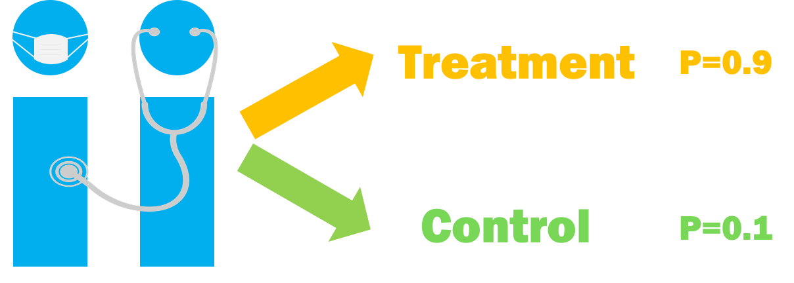

```{r, include = FALSE}
knitr::opts_chunk$set(warning = FALSE, message = FALSE, fig.align = "center", dpi = 320, fig.height = 4)
```


class: inverse

## Observational Studies



---
class: inverse


---
class: inverse


---
class: inverse

## Confounding


---
class: inverse

## Confounding


---

## Propensity scores

Rosenbaum and Rubin showed in observational studies, conditioning on **propensity scores** can lead to unbiased estimates of the exposure effect

1. There are no unmeasured confounders
2. Every subject has a nonzero probability of receiving either exposure

---

## Propensity scores

* Fit a **logistic regression** predicting exposure using known covariates

$$Pr(exposure = 1) = \frac{1}{1+\exp(-X\beta)}$$

* Each individuals' predicted values are the **propensity scores**

---

## Propensity scores

```{r, message = FALSE, warning = FALSE}
library(tidyverse)
library(broom)
```

---

## Propensity scores

```{r, eval = FALSE}
glm(exposure ~ confounder_1 + confounder_2 + confounder_3 + ..., 
    data = df,
    family = binomial())
```

---

## Propensity scores

```{r, eval = FALSE}
glm(exposure ~ confounder_1 + confounder_2 + confounder_3 + ..., 
    data = df,
    family = binomial()) %>%
  augment(type.predict = "response", data = df) 
```

---

## Propensity scores

```{r, eval = FALSE}
glm(exposure ~ confounder_1 + confounder_2 + confounder_3 + ..., 
    data = df,
    family = binomial()) %>%
  augment(type.predict = "response", data = df) #<<
```

---
class: inverse

## Propensity scores


---

# Example

.pull-left[
</img>
.small[Photo by Anna [CC-BY-SA-4.0](https://creativecommons.org/licenses/by-sa/4.0/deed.en)]
]

.pull-right[
.small[
Historically, guests who stayed in a Walt Disney World resort hotel were able to access the park during "Extra Magic Hours" during which the park was closed to all other guests.

These extra hours could be in the morning or evening.  

The Seven Dwarfs Mine Train is a ride at Walt Disney World's Magic Kingdom. Typically, each day Magic Kingdom may or may not be selected to have these "Extra Magic Hours".
]
]

--

**We are interested in examining the relationship between whether there were "Extra Magic Hours" in the morning and the average wait time for the Seven Dwarfs Mine Train the same day between 9am and 10am.**

---

```{r, echo = FALSE, message = FALSE, warning = FALSE, fig.height = 4}
library(ggdag)
set.seed(1234)
# set up DAG coordinates
coord_dag <- list(
  x = c(season = 0, close = 0, weather_wdwhigh = -1, x = 1, y = 2),
  y = c(season = -1, close = 1, weather_wdwhigh = 0.25, x = 0, y = 0)
)
# nicer labels for the nodes
labels <- c(
  x = "Extra Magic Morning",
  y = "Average wait",
  season = "Ticket Season",
  weather_wdwhigh = "Historic high temperature",
  close = "Time park closed"
)
# visualize the dag
dagify(
  y ~ x + close + season + weather_wdwhigh,
  x ~ weather_wdwhigh + close + season,
  coords = coord_dag,
  labels = labels
) %>%
  ggdag(use_labels = "label", text = FALSE) +
  theme_void() +
  scale_x_continuous(
    limits = c(-1.25, 2.25), 
    breaks = c(-1, 0, 1, 2), 
    labels = c(
      "\n(one year ago)", "\n(6 months ago)",
      "\n(3 months ago)", "9am - 10am\n(Today)"
    )
  ) +
  theme(axis.text.x = element_text()) +
  coord_equal(clip = "off")
```

---

class: inverse

## Your turn

`r countdown::countdown(minutes = 10)`

1. Using the **confounders** identified in the previous DAG, fit a propensity score model for `extra_magic_morning`
2. Stretch: Create two histograms, one of the propensity scores for days with extra morning magic hours and one for those without


